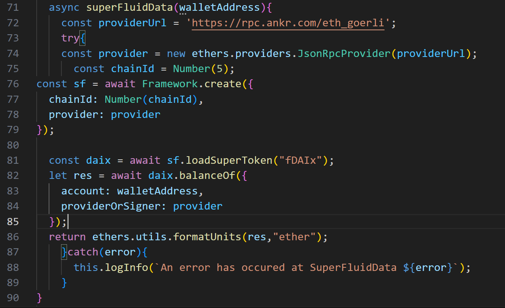
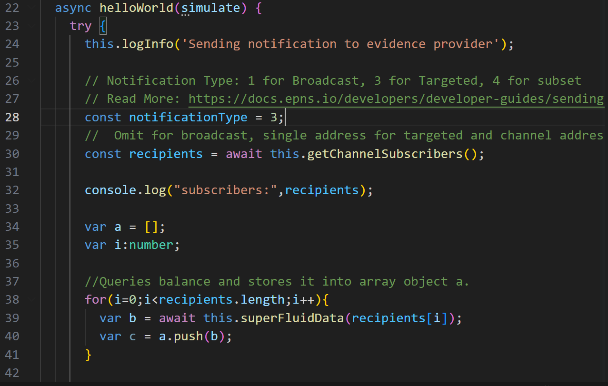
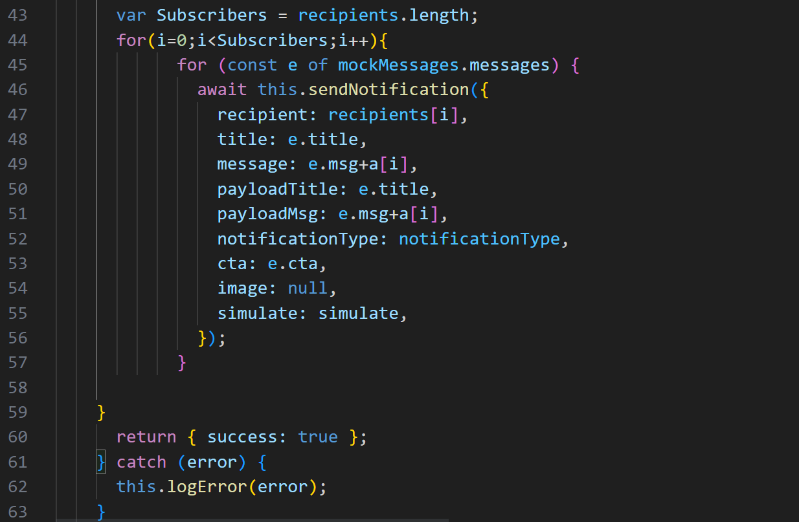
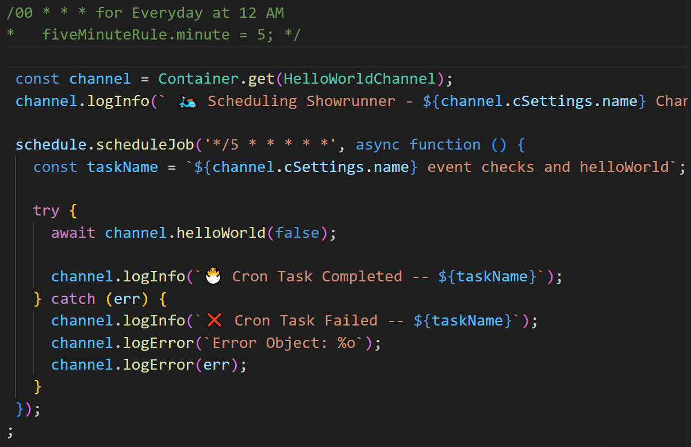

## Push Showrunners X Superfluid 

Aim : Users can subscriber to a Push Channel and will receive a notification every 5 seconds about their Balance.
- The main goal of superfluid it to provide realtime money streams and with push I am showing the balance being updated every second.

## Flow
- User Opt in a push channel
- Code fetches their super token balance 
- sends Notification about their super token balance every 5 seconds .
- Time can be updated to every day as mentioned before.

## Screenshots
- Superfluid function to Query balance of a user

- Function to Fetch Subscribers of a push channel

- For loop to send Notification about superfluid token balance to each subscriber .

-Cron Job to repeat the above process every 5 seconds.

